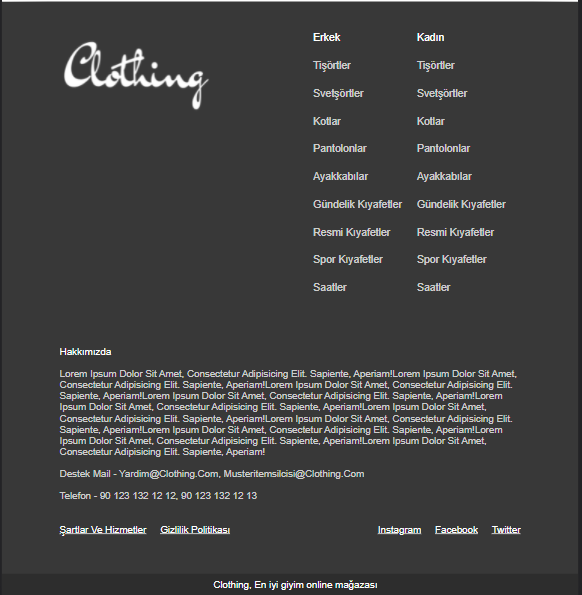
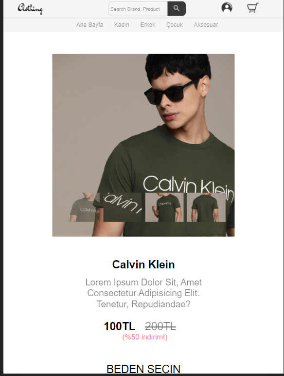
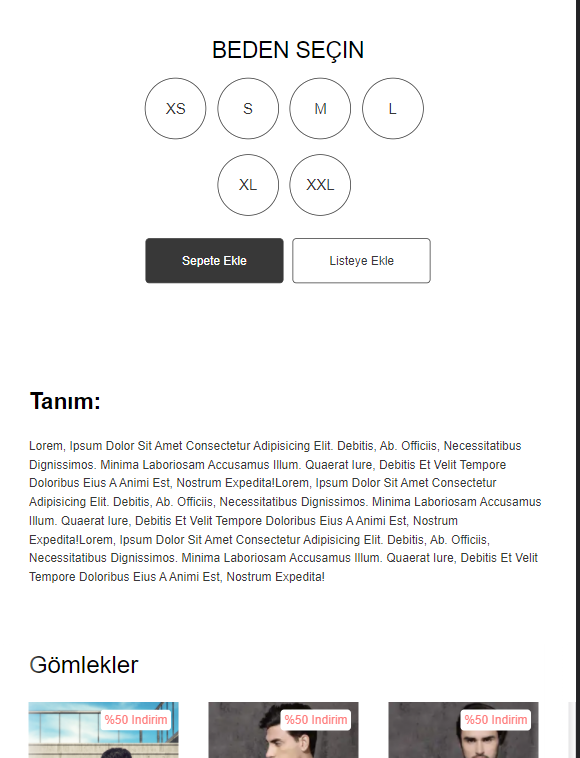
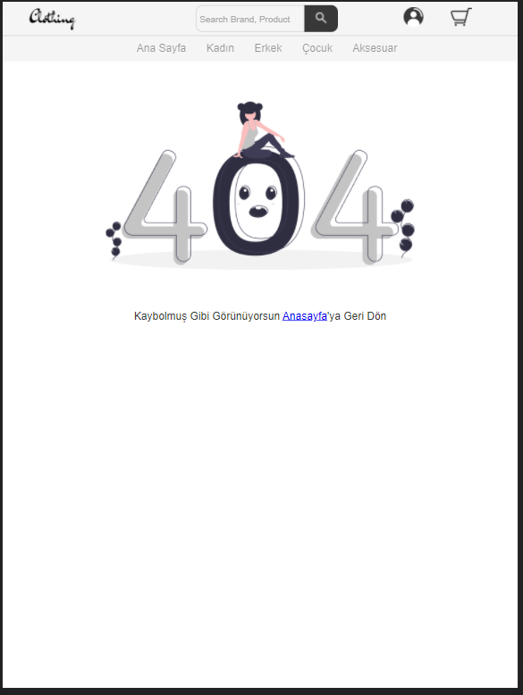

# Simple e-commerce theme

A simple e-commerce site designed using html css and js


## Run Locally

Clone the project

```bash
  git clone https://github.com/CihatKOCAK/simple-e-commerce-theme.git
```

## Screenshots

You can view the screenshots or watch the <a href ="https://www.youtube.com/watch?v=-UtQE1wBPfk">video</a> below.

# Index




# Product






# Search Page


# 404 Page


